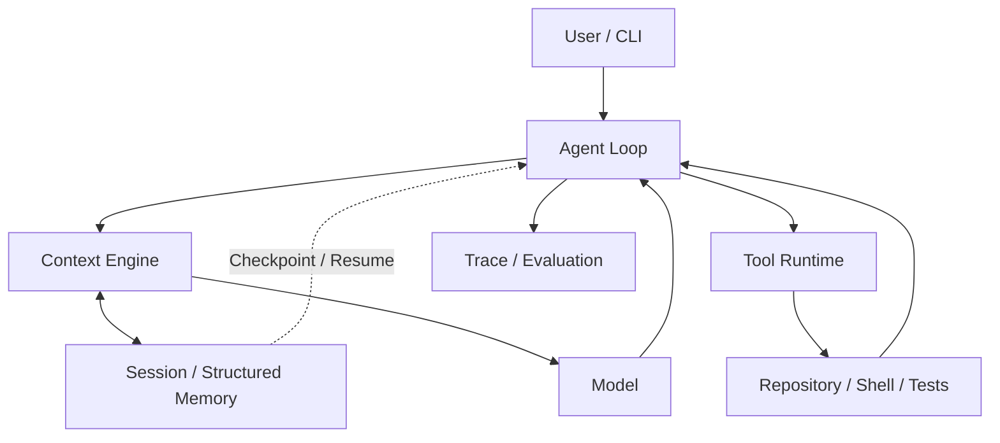

# Looprail

[](https://www.python.org/)
[](LICENSE)

**A local-first Coding Agent Runtime for long-running tasks in real code repositories.**

[中文说明](README.zh-CN.md)

Looprail separates model reasoning from deterministic runtime execution. The
model decides what to do; the Runtime governs tool execution, context assembly,
state persistence and recovery, tracing, and evaluation. The result is a
repository-aware execution loop that can keep working across many steps.

## Core Features

- **Agent Loop** — Carries a repository task through inspection, changes,
  commands, observations, and follow-up decisions.
- **Governed Tool Runtime** — Validates tool calls and applies execution,
  filesystem, timeout, and effect boundaries.
- **Repository-aware Context Engine** — Builds bounded context from the
  workspace, history, tools, and relevant memory.
- **Durable Session + Checkpoint / Resume** — Persists task state and supports
  conservative recovery after interruption.
- **Structured Memory** — Stores scoped, attributed knowledge for later work.
- **Trace + Deterministic Evaluation** — Makes execution inspectable and
  checks important contracts without requiring a live model.
- **Controlled Self-Evolution** — Evaluates candidate Runtime changes behind
  explicit evidence and human activation.
- **Local-first execution** — Works from a local checkout with the repository
  and its normal development tools in view.

## Simple Architecture



The model handles uncertain reasoning. The Runtime provides the deterministic
contracts around that reasoning.

## Quick Start

Looprail is currently documented from a source checkout; this workflow does
not assume a package has been published to PyPI.

From the repository root:

```bash
uv sync --frozen --extra dev --dev
uv run --frozen looprail --version
```

Configure a Provider and the local Runtime from the interactive wizard:

```bash
uv run --frozen looprail onboard --skip-memory
```

`--skip-memory` is the supported source-checkout setup when no external Memory
implementation is installed. The wizard still configures the Provider and
local execution path.

## Usage Example

Run one task against a real repository:

```bash
uv run --frozen looprail run --workspace "<repo-root>" -m "Inspect the failing tests, make the smallest safe fix, run the relevant tests, and summarize the result."
```

Replace `<repo-root>` with the target repository path. Run
`uv run --frozen looprail run --help` for session, resume, configuration, and
output options.

## Testing

The supported deterministic Runtime regression baseline is:

```powershell
.\scripts\run_runtime_baseline.ps1 -Python .\.venv\Scripts\python.exe
```

The current baseline reports **671 passed** on Windows with Python 3.12.
LooprailBench provides additional deterministic evaluation infrastructure; its
source and reproducibility helpers live under
[`benchmarks/looprailbench/`](benchmarks/looprailbench/).

## Roadmap

- Broader cross-platform validation.
- Expanded deterministic evaluation.
- A clearer public release and distribution workflow.

## License

Looprail is released under the [Apache License 2.0](LICENSE).

Third-party attribution and notices are preserved in [NOTICES.md](NOTICES.md)
and [LICENSES/](LICENSES/).
