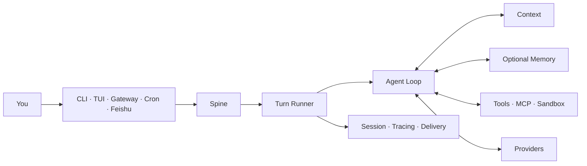

<div align="center">

# Pico

### One Agent Runtime across every place you work.

Run the same tool-using agent in your terminal, native TUI, background Gateway,
scheduled jobs, and message channels. The entry point changes; the Turn,
Session, Context, tools, and evidence model stay the same.


[Quick start](#from-install-to-a-real-reply) ·
[First-use guide](docs/onboarding/README.zh-CN.md) ·
[Feishu](docs/onboarding/feishu.zh-CN.md) ·
[Agent install contract](docs/onboarding/agent-install.md) ·
[中文](README.zh-CN.md)

</div>

---

Pico is a compact Agent Harness. Every host submits a Turn through the same
Runtime instead of building its own agent loop. Pico owns scheduling,
cancellation, Context assembly, tool execution, Session persistence, Tracing,
and delivery. Optional Memory backends plug into that Runtime, but this release
does not bundle an external Memory implementation.



## From install to a real reply

Pico requires Python 3.12. The native TUI uses Node.js 22; the installer can
provision a private Node runtime when the system version is missing or too old.

While this repository is private, clone it with your configured Gitee
credentials and run the installer from the checkout:

```bash
git clone https://gitee.com/htxoffical/pico-harness.git
cd pico-harness
./install.sh
```

Windows PowerShell:

```powershell
git clone https://gitee.com/htxoffical/pico-harness.git
Set-Location pico-harness
.\install.ps1
```

The installer resolves Pico from Gitee Releases and defaults to China-hosted
Python and Node.js mirrors. A private Release requires `PICO_GITEE_TOKEN`. You
can also set `PICO_WHEEL_URL` to a trusted wheel URL.

| Installer control | Purpose |
| --- | --- |
| `PICO_GITEE_TOKEN` | read a private Gitee Release |
| `PICO_WHEEL_URL` | install a trusted Pico wheel directly |
| `PICO_PYPI_INDEX` | override the Python package index |
| `PICO_NODE_MIRROR` | override the Node.js download mirror |
| `PICO_NODE_CHECKSUM_BASE` | override the Node.js checksum source |
| `PICO_NPM_REGISTRY` | override the npm registry |
| `PICO_UV_INSTALL_URL` | override the uv installer URL |

Configure Pico inside the repository where the agent will work:

```bash
cd /path/to/your-project
pico onboard --skip-memory
```

The four-step wizard follows the first result you can verify:

```text
LLM credentials -> Memory explicitly off -> first real Turn
                -> run location -> optional message channel
```

The current Gitee release does not contain an external Memory implementation,
so `--skip-memory` is the supported path. Pico records
`memory.backend = null`; it does not pretend that a missing backend is healthy.

After onboarding:

```bash
pico
pico run -m "Map the main request path in this repository"
pico doctor --probe
```

`pico doctor --probe` sends a real model request. A static configuration check
or a skipped probe does not prove that the Provider returned a reply.

See the [first-use guide](docs/onboarding/README.zh-CN.md) for private Release
authentication, non-interactive setup, exact acceptance checks, and recovery
paths.

## What Pico owns

| What you need | What Pico does |
| --- | --- |
| One agent across several surfaces | CLI, TUI, Gateway, Cron, and Channels submit the same Turn contract |
| Context that does not become a prompt dump | Context is retrieved, budgeted, and assembled before each model call |
| Tools with explicit boundaries | Filesystem, Shell, Web, MCP, messaging, and Subagents share confirmation and Sandbox controls |
| Recoverable conversations | Sessions persist independently from the current terminal process |
| Debuggable outcomes | Tracing, Provider usage, delivery state, and evaluation evidence remain separate records |
| Controlled improvement | Evolver produces candidates and evidence; activation and rollback remain explicit operator actions |

## Connect Feishu

Pico uses Feishu's WebSocket long connection, so you do not need a public IP or
webhook domain.

```bash
pico channels enable feishu \
  --app-id "cli_xxxxxxxxxxxxxxxx" \
  --app-secret "$FEISHU_APP_SECRET"

cd /path/to/your-project
pico gateway --workspace "$PWD" --verbose
```

The Feishu app still needs bot capability, message permissions,
`im.message.receive_v1`, and a published application version. Follow the
[Feishu guide](docs/onboarding/feishu.zh-CN.md) before testing an inbound
message. Saving channel configuration does not prove that live delivery works.

## Commands worth remembering

| Goal | Command |
| --- | --- |
| Configure Pico and run the first Turn | `pico onboard --skip-memory` |
| Open the native TUI | `pico` |
| Execute one Turn | `pico run -m "..."` |
| Check Runtime and Provider health | `pico doctor --probe` |
| Inspect installed Plugins | `pico plugins` |
| Manage message channels | `pico channels ...` |
| Serve enabled channels | `pico gateway --workspace /path/to/project` |
| Manage scheduled work | `pico cron ...` |
| Inspect Sessions and Tracing | `pico sessions ...` / `pico tracing` |
| Run operator-controlled evolution | `pico evolve check\|run\|status\|finalize` |

## State and security

| Scope | Default location |
| --- | --- |
| Global configuration and Runtime data | `~/.pico` |
| Foreground project | current directory |
| Foreground project state | `~/.pico/projects/<project-id>` |
| Gateway Workspace | explicit `--workspace`, otherwise `~/.pico/workspace` |

Normal startup keeps Pico state outside the repository. Executable Plugins are
loaded only from Pico's bundled set, operator-managed `~/.pico/plugins/`, and
installed `pico.plugins` entry points. A checkout's `.pico/plugins/` directory
is not an automatic startup source.

Read the [Memory boundary](docs/onboarding/memory.zh-CN.md) and
[troubleshooting guide](docs/onboarding/troubleshooting.md) before changing a
backend or handing the installation to another operator.

## Release repository boundary

This repository contains publishable source, deterministic tests, reviewed
benchmark code and fixtures, installers, onboarding material, and legal
notices. It excludes development plans, raw run artifacts, credentials, private
environment instructions, and unpublished external Memory artifacts.

Public benchmark results apply only to the frozen workload and verifier named
in their documents. They are not production SLAs. Start with the
[evaluation index](docs/evaluation/README.md) and [`benchmarks/`](benchmarks/).

## Build and verify

```bash
uv sync --frozen --extra dev --dev
npm ci
npm ci --prefix ui-tui
make check
make picobench-smoke
PICO_RELEASE_OUTPUT=/absolute/empty/output make release-dist
```

Pico is pre-1.0. Interfaces can change. `make check` verifies the retained
release tree; it does not replace a real Provider or channel smoke test.

## License

Pico is licensed under Apache License 2.0. See [LICENSE](LICENSE),
[NOTICES.md](NOTICES.md), and [LICENSES/](LICENSES/) for attribution.
