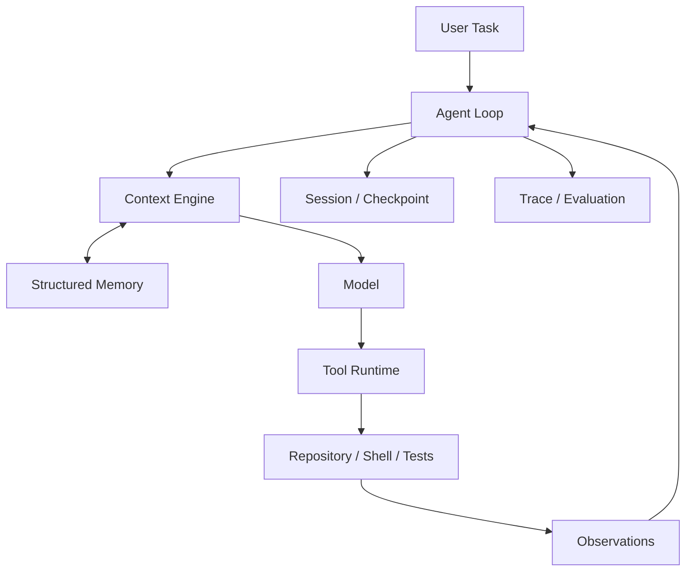

# ForgeAgent

[](https://www.python.org/)
[](LICENSE)

**ForgeAgent — A local-first Coding Agent for long-running tasks in real code repositories.**

[中文说明](README.zh-CN.md)

ForgeAgent is a personal open-source Coding Agent for working inside real repositories. It can inspect code, use local tools, change files, run tests, and continue from observed results across a multi-step task.

The model handles reasoning and decisions. The local Runtime provides controlled execution, state management, checkpoints, memory, and evidence for the work it performs.

The public identity is ForgeAgent; the current Python package and CLI retain `pico` compatibility identifiers, so commands below use `uv run pico`.

## What is ForgeAgent?

ForgeAgent is designed for tasks that need more than one prompt-and-answer cycle. A task can move through a repository workflow such as:

```text
Understand the task
  → inspect the repository
  → search and read code
  → modify files
  → run commands and tests
  → inspect results
  → continue reasoning
  → verify completion
```

The goal is a useful local execution loop with durable state and inspectable results, while keeping high-impact actions under explicit runtime controls.

## Features

- **Agent Loop** — Runs multi-step repository tasks instead of treating every request as a single model call.
- **Repository Tools** — Searches, reads, edits, and works with shell commands and tests in a real workspace.
- **Tool Runtime** — Validates model-requested tool calls and applies controlled execution policies.
- **Context Management** — Builds bounded, relevant repository context instead of appending everything to every prompt.
- **Checkpoint & Resume** — Persists session state so interrupted work can be continued.
- **Structured Memory** — Stores scoped, reusable knowledge that can support future tasks.
- **Trace & Evaluation** — Records execution traces and uses deterministic verification to check results.
- **Controlled Self-Evolution** — Uses execution evidence to evaluate candidate Runtime improvements under explicit human control.

## Architecture

The main loop is intentionally simple at the product level:



## Quick Start

After cloning the GitHub repository, run these commands from its root:

```bash
cd forge-agent
uv sync --frozen --extra dev --dev
uv run pico --version
```

Initialize local settings when needed:

```bash
uv run pico onboard --skip-memory
```

Run a task against a repository:

```bash
uv run pico run --workspace /path/to/project \
  -m "Find the cause of the failing tests, fix the bug, run the relevant tests, and summarize the changes."
```

On Windows, replace `/path/to/project` with the path to the target repository. Use `uv run pico run --help` for session, resume, configuration, and output options.

## Example

```bash
uv run pico run --workspace /path/to/project \
  -m "Add the missing validation, update the tests, and verify the change."
```

ForgeAgent can inspect the workspace, invoke repository tools, edit code, execute tests, and use their observations to decide what to do next.

## Testing

From the repository root:

```powershell
.\scripts\run_medium_baseline.ps1
```

The current frozen core Runtime acceptance suite reports **671 passed** on the Windows / Python 3.12 baseline. This is the core acceptance result, not a claim that every repository test is always green.

## Roadmap

- Improve CLI visualization and interaction.
- Add richer execution-progress rendering.
- Strengthen sandbox and high-risk tool policies.
- Expand real-repository Coding Agent benchmarks.
- Improve Context compression and retrieval strategies.
- Improve long-term Memory quality and lifecycle.
- Expand Controlled Self-Evolution experiments.
- Improve cross-platform portability.

## License

ForgeAgent is released under the [Apache License 2.0](LICENSE).

Third-party attribution and notices are preserved in [NOTICES.md] and [LICENSES/].
