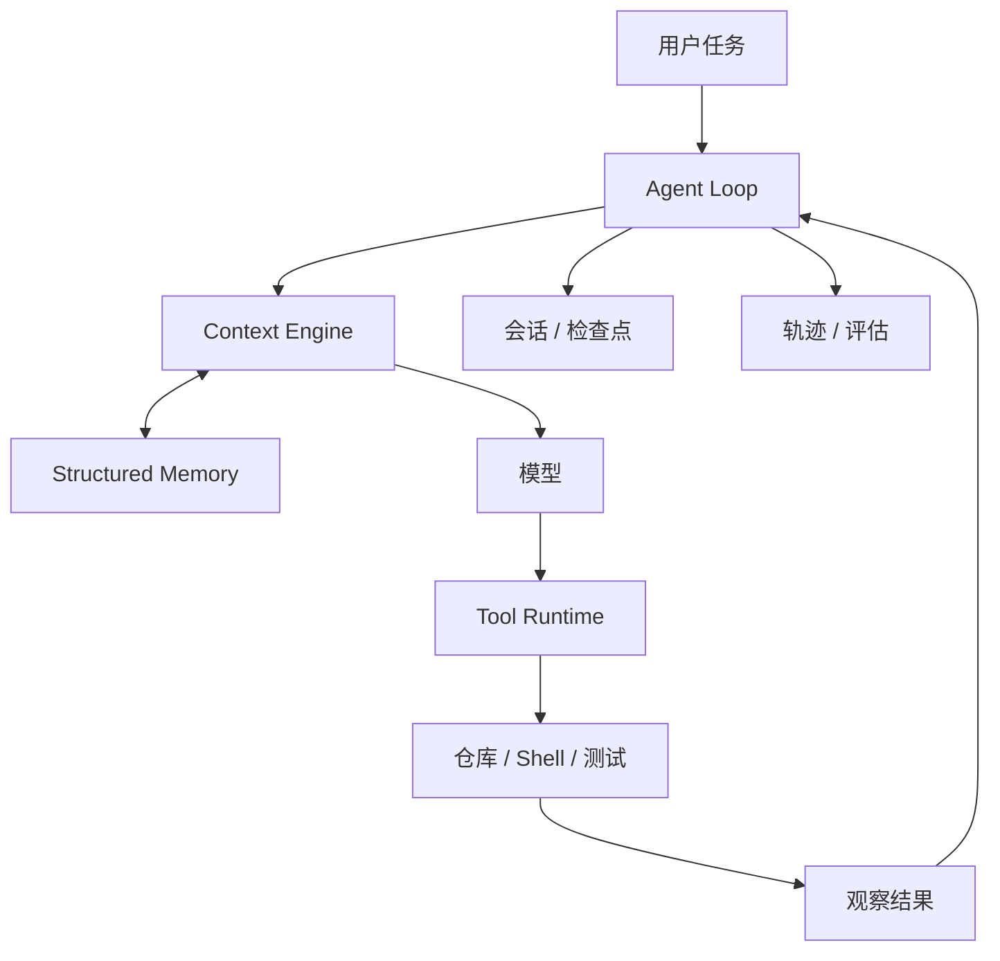

# ForgeAgent

[](https://www.python.org/)
[](LICENSE)

**ForgeAgent —— 面向真实代码仓库长链路任务的 Local-first Coding Agent。**

[English README](README.md)

ForgeAgent 是一个面向真实代码仓库的个人开源 Coding Agent。它可以检查代码、使用本地工具、修改文件、运行测试，并根据观察结果持续推进多步骤任务。

模型负责推理和决策；本地 Runtime 负责受控执行、状态管理、检查点、记忆以及过程证据。

项目的公开身份是 ForgeAgent；当前 Python 包和 CLI 仍保留 `pico` 兼容标识，因此下方命令使用 `uv run pico`。

## 项目简介

ForgeAgent 面向无法靠一次问答完成的工程任务。一个任务可以沿着下面的仓库工作流持续推进：

```text
理解任务
  → 检查仓库
  → 搜索并阅读代码
  → 修改文件
  → 执行命令和测试
  → 检查结果
  → 继续推理
  → 验证完成
```

目标是在本地提供有用的执行循环、持久状态和可检查结果，同时让高影响操作处于明确的 Runtime 控制之下。

## 核心功能

- **Agent Loop** —— 执行多步骤仓库任务，而不是把每个请求当成一次模型调用。
- **Repository Tools** —— 在真实工作区中搜索、读取、编辑，并运行 Shell 命令和测试。
- **Tool Runtime** —— 校验模型请求的工具调用，并应用受控执行策略。
- **Context Management** —— 构建有边界且相关的仓库上下文，而不是把所有内容不断追加到提示词中。
- **Checkpoint & Resume** —— 持久化会话状态，支持继续被中断的工作。
- **Structured Memory** —— 保存有范围的可复用知识，为后续任务提供支持。
- **Trace & Evaluation** —— 记录执行轨迹，并用确定性验证检查结果。
- **Controlled Self-Evolution** —— 基于执行证据评估候选 Runtime 改进，并由人明确控制是否采用。

## 架构

从产品视角看，主循环保持简单：



## 快速开始

从 GitHub 克隆仓库后，在仓库根目录执行：

```bash
cd forge-agent
uv sync --frozen --extra dev --dev
uv run pico --version
```

需要时初始化本地设置：

```bash
uv run pico onboard --skip-memory
```

针对一个代码仓库运行任务：

```bash
uv run pico run --workspace /path/to/project \
  -m "找出失败测试的原因，修复问题，运行相关测试，并总结修改内容。"
```

在 Windows 上，将 `/path/to/project` 替换为目标仓库路径。使用 `uv run pico run --help` 查看会话、恢复、配置和输出选项。

## 使用示例

```bash
uv run pico run --workspace /path/to/project \
  -m "补上缺失的校验，更新测试，并验证这次修改。"
```

ForgeAgent 可以检查工作区、调用仓库工具、编辑代码、执行测试，并根据测试和命令的观察结果决定下一步。

## 测试

在仓库根目录执行：

```powershell
.\scripts\run_medium_baseline.ps1
```

当前冻结的核心 Runtime acceptance suite 在 Windows / Python 3.12 基线下报告 **671 passed**。这是核心验收结果，不表示仓库中的每个测试在所有环境下都始终通过。

## 后续计划

- 改进 CLI 的可视化和交互。
- 增加更丰富的执行进度展示。
- 强化沙箱和高风险工具策略。
- 扩展真实代码仓库 Coding Agent 基准。
- 改进 Context 压缩和检索策略。
- 改进长期 Memory 的质量和生命周期管理。
- 扩展 Controlled Self-Evolution 实验。
- 改进跨平台可移植性。

## 许可证

ForgeAgent 使用 [Apache License 2.0](LICENSE) 发布。

第三方归属和通知保留在 [NOTICES.md] 与 [LICENSES/] 中。
