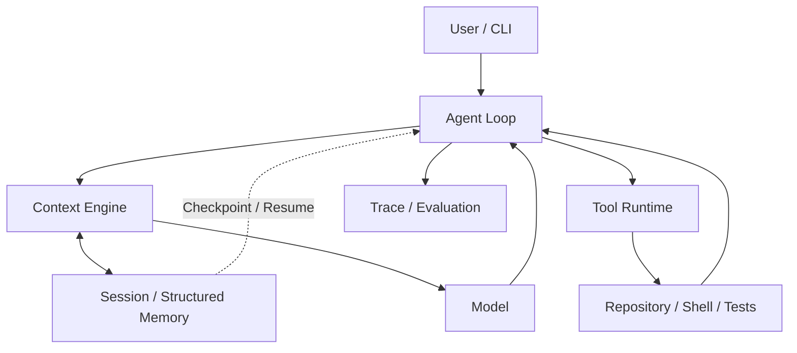

# Looprail

[](https://www.python.org/)
[](LICENSE)

**Looprail 是一个面向真实代码仓库长链路任务的 local-first Coding Agent Runtime。**

[English README](README.md)

Looprail 将模型推理与确定性的 Runtime 执行分开：模型决定下一步做什么，Runtime
负责工具执行、上下文组装、状态持久化与恢复、Trace 以及 Evaluation。这样，Agent
可以在真实仓库中持续检查、修改、运行和验证，而不是只完成一次问答。

## 核心功能

- **Agent Loop** —— 让仓库任务经过检查、修改、命令、观察和后续决策的完整循环。
- **Governed Tool Runtime** —— 校验工具调用，并应用执行、文件系统、超时和 Effect 边界。
- **Repository-aware Context Engine** —— 从工作区、历史、工具和相关 Memory 中构建有边界的上下文。
- **Durable Session + Checkpoint / Resume** —— 持久化任务状态，并在中断后进行保守恢复。
- **Structured Memory** —— 保存带范围和来源信息的知识，供后续任务使用。
- **Trace + Deterministic Evaluation** —— 让执行过程可检查，并在不依赖实时模型的情况下验证重要契约。
- **Controlled Self-Evolution** —— 在明确的证据和人工激活控制下评估 Runtime 候选改进。
- **Local-first execution** —— 从本地检出开始工作，并直接看到仓库及其开发工具。

## 简单架构



模型负责不确定性的推理，Runtime 负责包围推理过程的确定性执行契约。

## 快速开始

目前以源码检出方式使用 Looprail；下方流程不假设 Looprail 已经发布到 PyPI。

在仓库根目录执行：

```bash
uv sync --frozen --extra dev --dev
uv run --frozen looprail --version
```

使用交互式向导配置 Provider 和本地 Runtime：

```bash
uv run --frozen looprail onboard --skip-memory
```

当环境中没有外部 Memory 实现时，`--skip-memory` 是当前受支持的源码检出配置。
向导仍会配置 Provider 和本地执行路径。

## 使用示例

针对一个真实代码仓库运行任务：

```bash
uv run --frozen looprail run --workspace "<repo-root>" -m "检查失败的测试，做出最小且安全的修复，运行相关测试，并总结结果。"
```

将 `<repo-root>` 替换为目标仓库路径。使用 `uv run --frozen looprail run --help`
查看 Session、Resume、配置和输出选项。

## 测试

受支持的确定性 Runtime 回归基线如下：

```powershell
.\scripts\run_runtime_baseline.ps1 -Python .\.venv\Scripts\python.exe
```

当前 Windows / Python 3.12 基线报告 **671 passed**。LooprailBench 提供额外的确定性
Evaluation 基础设施，源码和复现工具位于
[`benchmarks/looprailbench/`](benchmarks/looprailbench/)。

## 后续计划

- 扩大跨平台验证范围。
- 扩展确定性 Evaluation。
- 建立更清晰的公开发布和分发流程。

## 许可证

Looprail 使用 [Apache License 2.0](LICENSE) 发布。

第三方归属和通知保留在 [NOTICES.md](NOTICES.md) 与 [LICENSES/](LICENSES/) 中。
