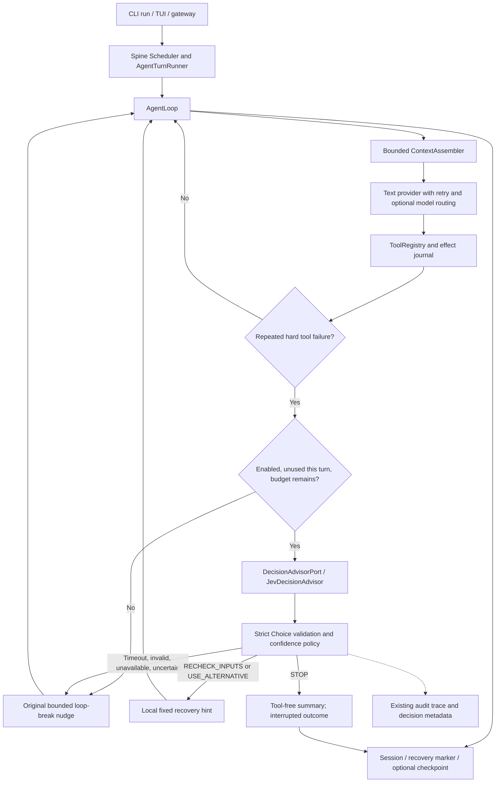

# Jev adaptive tool recovery

## Current implementation and motivation

The audited baseline is commit `57e160c2dae9dc45287822cd06694e682b83f963` on `main`.
The Python entry point is `looprail.cli.commands:run`. CLI run, TUI RPC and the
gateway share `assemble_runtime`. Spine's Scheduler serializes conversation lanes,
and `AgentTurnRunner` enters `AgentLoop.run_turn` / `_process_message` /
`_run_agent_loop`. The loop assembles bounded repository/history/skill/memory
context, calls a text provider, dispatches tool calls through ToolRegistry, records
effects, persists sessions and returns output through a single event boundary.

There is no mandatory Planner → Task Graph → Executor → Critic pipeline in this
main path. The main model plans through its tool calls. `agent/recovery/planner.py`
is a deterministic planner for durable effect observations, not a task-decomposition
LLM. Eval hooks and the separately invoked Evolver exist, but are not an always-on
Critic in every turn. Memory backends are optional plugins; local sessions and
skills remain available without them. Persistence uses local session/effect/recovery
files and optional shadow Git checkpoints, rather than requiring a database server.

Before this change, two consecutive hard failures of the same tool triggered one
generic change-approach nudge, with at most two nudges per turn. Transient failures
and successful empty searches were excluded. This is useful deterministic detection,
but does not distinguish inspecting wrong inputs, pursuing a different method,
and reporting that useful progress is blocked.

## Candidates and selection

| Candidate | Fit with actual code | Interview value and trade-off |
| --- | --- | --- |
| A: model routing | EcoClaw quality/cost ranking and guarded KNN already exist | Clear demo, but another lane router overlaps existing mechanisms and requires model/profile evaluation |
| B: planner strategy | No separate main-path Planner or task graph | Would require unrelated architecture and an artificial bypass |
| C: adaptive recovery | Existing bounded hard-failure decision point | Strong policy/runtime/trace/fallback story; focused change and no calls on successful tasks |
| D: Critic escalation | Eval hooks exist; no universal uncertainty-producing Critic | Would need a new uncertainty contract and extra evaluations |
| E: evolution reviewer | Real candidate/evidence/activation subsystem exists | Potentially useful, but a semantic verdict must not replace evidence or human activation; longer, less direct demo |

**Selected: C, one tool-recovery advisor.** Agent-engineering depth, architecture
coherence, usefulness, demo clarity, observability, reliability and testability
come from reusing an existing governed runtime boundary. Complexity is bounded to
one port, one adapter and one policy. Vendor dependence stays behind the port.
Explainability comes from recorded decisions and real subsequent tool effects.
No secondary routing, Planner, Critic or Evolver system was added.

## Why Jev here, and why not a provider

Jev supplies a narrow semantic judgment over the user goal, failure kind,
available tools and remaining budget. Exact failure counting, budgets, validation,
tool permissions and side effects stay in code. An if/else rule is sufficient to
detect failures; selecting a useful recovery approach depends on the goal and
available alternatives. This separation is an architectural hypothesis, not a
benchmark claim that Jev always beats a heuristic.

Jev is a typed decision model rather than a text/tool-calling assistant. It uses
`state` / `questions` and returns a Choice distribution. It does not implement
Looprail's text-provider interface. Sources: [TypeSafe Choice](https://docs.typesafe.ai/primitives/choice),
[HTTP API](https://docs.typesafe.ai/api), and
[OpenRouter's Jev introduction](https://openrouter.ai/blog/insights/what-is-jev/).

## Architecture and runtime flow



1. The existing detector counts consecutive hard failures of the same tool; it
   does not claim that their arguments or error text are identical.
2. At the existing nudge boundary, Runtime calls the advisor at most once per
   turn, only if another iteration remains. No request is made on the final
   iteration or on the normal successful path. Counters are turn-local.
3. The state is bounded: goal ≤ 2,000 characters, tool name ≤ 128 characters,
   controlled failure kind, failure count, remaining iterations, and up to 64
   available tool names. No tool arguments, raw tool output, history, file
   content, provider config or credentials enter this state. Mid-turn injected
   user text updates the goal. Truncated state can reduce judgment quality.
4. The adapter performs one HTTP request without retries or redirects. The
   policy independently bounds total advisor latency, including custom ports.
5. Strict schema validation runs at both the adapter and policy boundaries.
   Policy accepts only sufficiently confident recommendations.
6. RECHECK_INPUTS and USE_ALTERNATIVE inject local fixed templates; the text
   model chooses subsequent tools through the existing ToolRegistry. These are
   suggestions, not a guarantee that the text model follows them. Later failure
   streaks receive the existing bounded generic hint, without another Jev call.
7. STOP prevents further tool batches in this turn and reuses tool-free final
   synthesis. The outcome is `interrupted`, even if a useful summary is generated.
   Its normal recovery marker/checkpoint path still runs. A current batch has
   already finished before the decision; Jev does not undo any effects.

## Decision schema and authority

```json
{
  "type": "choice",
  "choice": "RECHECK_INPUTS",
  "confidence": 0.95,
  "probabilities": {
    "RECHECK_INPUTS": 0.98,
    "USE_ALTERNATIVE": 0.01,
    "STOP": 0.01
  }
}
```

The action enum is closed. Confidence and probabilities must be finite numbers
in [0, 1], all three probabilities must be present and sum to one (tolerance
0.001), and the selected action must have maximal probability. Extra answer
fields are rejected. Unknown models/actions, commands and free-text instructions
cannot become an executable recommendation. The accepted decision carries
`decision_source`, `selected_action`, `suggested_action`, `confidence`, `reason`,
`fallback_used`, `latency_ms`, and `decision_type=TOOL_RECOVERY`.

`reason` is a local policy code (`accepted_recheck_inputs`, `low_confidence`,
etc.), **not a fabricated model explanation**. Jev returns typed answers rather
than generated rationales. Confidence summarizes distribution concentration;
it does not prove task correctness or give permission to execute a side effect.

## Fallback and cancellation

| Condition | Result |
| --- | --- |
| Disabled | No advisor constructed or called; original nudge and budgets |
| Missing key/model or invalid optional environment settings | BASELINE decision, original nudge |
| Timeout | BASELINE; the total advisor deadline is bounded |
| HTTP/network error, rate limit or redirect | BASELINE; no request retry |
| Invalid/empty JSON, wrong schema, unknown enum or invalid probability distribution | BASELINE |
| Confidence below threshold | BASELINE, with rejected action/confidence recorded |
| Unexpected port exception | BASELINE, closed error code only |
| Cancellation | Propagated; never turned into a retry or fallback |

The original second nudge and iteration ceiling remain. Neither accepted advice
nor fallback retries a durable unknown effect, bypasses tool permissions, adds
iterations, raises spawn limits, or changes model/provider selection.

## Observability and secrets

The existing `audit.span.v1` trace records `agent.recovery.decision`, correlated
with `turn.id` and session attributes, plus the `JEV_DECISION` event. The trace
includes trigger, iteration and the decision fields above. These fields also
enter the turn's context metadata. CLI logging (`looprail run --logs`) emits a compact
`JEV_DECISION` line; `looprail tracing` can inspect the existing trace store.
The demo prints the bounded decision and executed tools.

There is no new metrics backend or independent dashboard. Latency, accepted
actions and fallback frequency can be aggregated from these trace attributes.
Jev usage/cost is not mixed into the existing text-provider token accounting.

The integration does not log raw requests, responses, exceptions, headers or
credentials. Goal projection removes common credential patterns, and the adapter
also removes its actual configured key from the goal. This is best-effort
redaction, not a universal secret scanner; enabling the feature authorizes sending
the bounded user goal to the configured Jev service. Credentials remain
environment-only and are excluded from settings repr. No implicit `.env` search
or automatic credential-file loading occurs in production.

## Configuration

File configuration is an optional `runtime.jev` block in Looprail's normal config:

```json
{
  "runtime": {
    "jev": {
      "enabled": true,
      "transport": "openrouter",
      "model": "typesafe/jev-1.13",
      "timeoutSeconds": 2.0,
      "confidenceThreshold": 0.65
    }
  }
}
```

| Environment variable | Default / purpose |
| --- | --- |
| `LOOPRAIL_JEV_ENABLED` | false; explicit kill switch overrides file config |
| `LOOPRAIL_JEV_TRANSPORT` | openrouter; also supports typesafe_direct |
| `LOOPRAIL_JEV_MODEL` | OpenRouter defaults to typesafe/jev-1.13; direct requires explicit model |
| `LOOPRAIL_JEV_ENDPOINT` | Direct endpoint only; default https://api.typesafe.ai/v1/systemone |
| `LOOPRAIL_JEV_TIMEOUT_SECONDS` | 2.0; finite, positive, ≤ 30 |
| `LOOPRAIL_JEV_CONFIDENCE_THRESHOLD` | 0.65; finite in [0, 1]; illustrative, not calibrated on Looprail tasks |
| `LOOPRAIL_OPENROUTER_API_KEY` | Environment-only OpenRouter credential |
| `LOOPRAIL_JEV_API_KEY` | Environment-only direct TypeSafe credential |

Model, transport, endpoint, timeout and threshold prefer Looprail environment
values, then file defaults. No foreign-project environment aliases or fallback
credentials are read. An explicitly empty or invalid value is validated rather
than falling back to another project's setting. OpenRouter reads only
`LOOPRAIL_OPENROUTER_API_KEY`; direct TypeSafe reads only `LOOPRAIL_JEV_API_KEY`.
OpenRouter's endpoint is fixed to `https://openrouter.ai/api/alpha/decisions`.
Direct endpoints require HTTPS and reject URL credentials, query strings and
fragments. Secrets are absent from the file schema. Placeholder-only settings
are in `docs/examples/jev.env.example`.

## Cross-project isolation

Looprail owns its `LOOPRAIL_*` configuration contract. Developers may reuse the
same credential value in another project, but each project supplies it under
its own environment names. No code or configuration dependency on another
project is introduced. Credential migration is an explicit local process-only
operation: no new secret file, source-code value, log or Git entry is required.
Regression tests supply foreign environment names deliberately and confirm that
they cannot enable transport overrides or satisfy a missing Looprail key.

## Confidence Threshold

`0.65` is a **conservative configurable default**, not a benchmarked optimal
threshold. Choice confidence measures concentration of the returned probability
distribution; it is not task-success probability or execution permission.
See [TypeSafe confidence](https://docs.typesafe.ai/confidence).

The [Recovery Evaluation Scaffold](../benchmarks/recovery/README.md) contains
15 human-authored failure cases with acceptable action sets. It reuses the same
context projection, advisor port and policy without adding a Runtime lane:

```powershell
python -m scripts.eval_jev_recovery --advisor fake
python -m scripts.eval_jev_recovery --advisor fake --threshold 0.85 --json
# Explicit opt-in; up to 15 paid decisions, never run automatically in CI.
python -m scripts.eval_jev_recovery --advisor live --json
```

The default fake uses rules over context, never expected labels. Its confidence
is simulated and its acceptance count only tests the harness. Rows preserve
suggested and policy-selected actions, confidence, fallback reasons and timing.
The scaffold supports failure-case regression, strategy distribution analysis,
fallback observation and future threshold calibration. Calibration requires
representative live decisions, reviewed labels and held-out cases; task-success
claims additionally require real execution and a baseline comparison. This small
corpus cannot establish Jev accuracy, an optimal threshold or a success uplift.

## Demonstration

From the repository root, these two commands run without a key or network:

```powershell
.\.venv\Scripts\python.exe -m scripts.jev_recovery_demo --case normal --advisor fake
.\.venv\Scripts\python.exe -m scripts.jev_recovery_demo --case recover --advisor fake
```

The first succeeds with one file read and no advisor call. The second safely
attempts a nonexistent file twice, receives a simulated RECHECK_INPUTS decision,
lists the directory, reads the real file, and persists the session/effects.
The main text provider is **scripted**, and `fake` is a labeled advisor double;
this demonstrates wiring and authority, not model-quality improvement.

Other reproducible paths:

```powershell
.\.venv\Scripts\python.exe -m scripts.jev_recovery_demo --case recover --advisor fake --action STOP
.\.venv\Scripts\python.exe -m scripts.jev_recovery_demo --case recover --advisor disabled
.\.venv\Scripts\python.exe -m scripts.jev_recovery_demo --case recover --advisor live
```

The live command uses existing process credentials. An explicitly supplied
`--env-file <existing-local-file>` reads only Jev-related environment values plus
the Looprail OpenRouter key into memory; it never copies or prints the credential.
Live mode makes a paid request only at the failure boundary. Trace artifacts stay
in ignored `.looprail/evidence/jev-demo` (or the specified `--trace-dir`).

## Tests and validation

`tests/test_jev_decision.py` validates request/response contracts, enums, bounds,
probabilities, disabled/missing settings, direct/OpenRouter configuration,
timeouts, HTTP/JSON failures, uncertainty, cancellation and safe telemetry.
`tests/integration/test_jev_recovery_runtime.py` exercises HTTP mock → advisor →
policy → real Runtime → actual file tools → effects/session/trace, including
STOP with hostile summary tool calls and disk-reloaded interruption/session state,
unchanged fallback, no normal-path call and one call per turn.
`tests/test_jev_recovery_eval.py` covers corpus validation, offline defaults,
threshold comparisons, invalid-response accounting and missing live credentials.
All tests are deterministic and use fake advisors or `httpx.MockTransport`.

Reproduce focused validation:

```powershell
.\.venv\Scripts\python.exe -m pytest tests/test_jev_decision.py tests/integration/test_jev_recovery_runtime.py tests/test_jev_recovery_eval.py -q
.\scripts\run_runtime_baseline.ps1 -Python .\.venv\Scripts\python.exe
```

The full execution results and real-call receipt are recorded in
`docs/JEV_VALIDATION.md`. A live recovery demonstration proves transport and
execution wiring with real Jev and scripted main-model behavior. It does not
prove a causal reliability/accuracy/cost improvement across production tasks.

## Trade-offs and evaluation next steps

- Latency: one bounded call only on the first eligible failure streak. A new
  short-lived HTTP client avoids shared shutdown/concurrency state, at the cost
  of reconnect overhead on recovery turns.
- Cost: a paid judgment plus the normal text-provider continuation or tool-free
  summary. No cache or retry layer was added; there is no measured saving claim.
- Failure: original recovery remains available; transient errors keep their
  existing path. STOP can end a recoverable turn too early, so the feature is
  opt-in and the outcome remains interrupted.
- Vendor: the DecisionAdvisorPort separates policy from HTTP transport. The
  Looprail-owned contract supports direct TypeSafe and OpenRouter; the
  latter currently uses an alpha endpoint.
- Non-determinism: accepted hints are still interpreted by the text model.
  Closed actions, fixed templates, confidence gating and Runtime budgets bound
  behavior but cannot guarantee correct semantic judgment.
- Evaluation: a future labeled recovery corpus should compare the baseline
  against advice, count verified recovery, premature STOP, repeat failures,
  fallback rate, added latency and actual spend. Tune confidence thresholds on
  that corpus before claiming effectiveness.

## Interview explanation

**15 seconds:** Looprail 原来对连续工具失败统一提示改路。我加入独立 Jev 恢复顾问，
返回结构化策略，本地 Policy 校验后由 Runtime 执行；不可用就回退原逻辑。

**30 seconds:** 我先审计了真实执行链，发现已有路由和持久化恢复，因此没有再包装一个
LLM Provider。Jev 只在连续确定性工具失败时，结合任务目标、失败类型和剩余预算建议
检查输入、换方法或停止。本地 Policy 校验枚举、概率和置信度，Runtime 保留工具权限和
执行预算。超时或非法结果回到原有提示；停止也标记未完成。每轮最多一次调用，决策与
实际工具效果能从同一 trace 追踪。

**Two-minute technical version:** 主入口通过共享装配创建 AgentLoop，Spine 负责会话
串行化和终态事件。原 Runtime 已能识别连续工具硬失败，但只有统一 nudge。我保留这个
确定性触发器，把语义策略判断放在可替换 DecisionAdvisorPort 后面。Adapter 用官方
Choice API，不输出命令或模型名；返回值在 Adapter 和 Policy 两次校验，包括闭集动作、
有限概率、分布总和、最高概率选项和置信度门槛。每轮最多一次，最终预算耗尽时不再
调用。检查和换方法只注入本地模板，后续工具仍经现有 Registry；STOP 则进入禁用工具
的总结路径并保持 interrupted，让持久化恢复仍能识别未完成任务。错误响应只转成
封闭原因码，超时、缺 key、HTTP 错误、非法 JSON 和低置信度都返回原 nudge，取消则
继续传播。新增测试使用 HTTP mock 和真实文件工具，验证建议如何改变下一步执行，
再运行原 Runtime 基线。两个演示明确区分脚本模拟和真实 Jev 调用。我没有把少数演示
结果当成准确率或成本指标；下一步要用标注失败任务集验证恢复率、提前停止和延迟。
